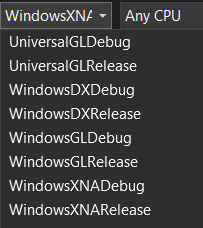
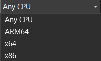
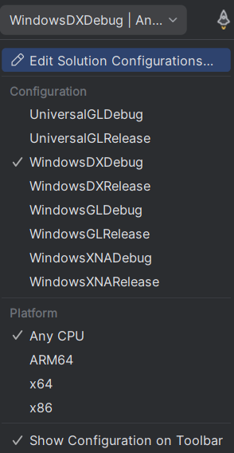

# Build & Publish #

The information below describes the steps that the default build script (build.ps1) performs.

Engine configurations
---------------------

The client uses different APIs to render itself, called Engine. Engine defines the technology used and the platform where the client can be launched:

Any platform (Windows, Linux, macOS):
* UniversalGL

Only Windows:
* WindowsDX
* WindowsGL
* WindowsXNA

TargetFramework configurations
------------------------------

For each Engine configuration one or more TargetFrameworks will be build:

UniversalGL:
* net8.0

WindowsDX, WindowsGL & WindowsXNA:
* net4.8

Overview of the Engine configurations differences:

| Configuration | OS Support | Default Platform | Technology                    |
| ------------- | ---------- | ---------------- | ----------------------------- |
| UniversalGL   | Any        | AnyCPU           | MonoGame DesktopGL            |
| WindowsDX     | Windows    | AnyCPU           | MonoGame WindowsDX + WinForms |
| WindowsGL     | Windows    | AnyCPU           | MonoGame DesktopGL + WinForms |
| WindowsXNA    | Windows    | x86              | Microsoft XNA + WinForms      |

Build output
------------

The build output when using the `dotnet publish` command is created in `\Compiled`.

Launching the client is done by running e.g.: `dotnet clientogl.dll`

Building without IDE
--------------------

To build the client without Visual Studio you should install the .NET 8.0 SDK, PowerShell 7.0 and run `Script\Build.bat`. Compiled result will be placed to `Compiled` folder in the root of the repository.

Building with Visual Studio
---------------------------

> [!IMPORTANT] 
> IDEs can build Release configurations, but they are forbidden to run due to compile-time optimizations on binaries.

You can select the desired configuration directly from the solution configurations:

Note that the XNA configurations can only be built/debugged with `x86`.

> [!WARNING]
> After changing the solution configuration in Visual Studio you *have to* manually execute `dotnet restore` through cmd/powershell in the project's root directory to load packages and also reboot Visual Studio to exclude [NETSDK1004](https://learn.microsoft.com/en-us/dotnet/core/tools/sdk-errors/netsdk1004) and [NETSDK1005](https://learn.microsoft.com/en-us/dotnet/core/tools/sdk-errors/netsdk1005) errors.

Building with Rider
-------------------

Select desired configuration from list in the top panel:

