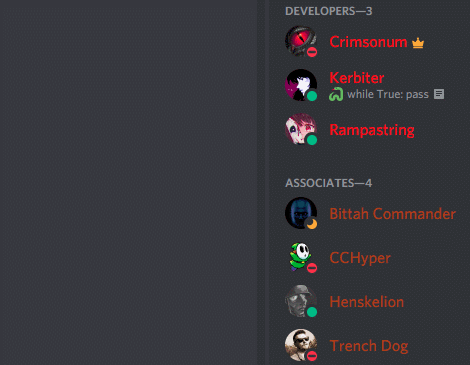

# Discord Rich Presence support in XNA CnCNet client

About Discord Rich Presence
-----------------------------------
Discord Rich Presence (DRP) is a useful feature that allows Discord users to show the details about the currently active game or application to other users. With DRP existing players can show their activity to their friends and spread awareness of your mod/game, thus increasing popularity.

The client shows lobby type, name, map/mission name, gamemode, players amount, available slots, whether the player is ingame, time spent, player faction etc. depending on the current user's activity.

XNA client supports showing DRP information customized to your mod/game, provided you follow the steps below to set up the presence for your mod/game.

How to set up DRP for your mod/game
-----------------------------------

> [!NOTE]
> You are required to be logged in a Discord account.

1. Go to [Discord developers portal](https://discord.com/developers/applications).
2. Click the `New Application` button. Type the name of your mod, agree with Discord's policy by clicking on "policy" checkbox and click `Create` button.
3. In `General Information` tab of your application you can find your `Application ID`. You should insert it as a value of `Resource/ClientDefinitions.ini`->`[Settings]`->`DiscordAppId` key.

4. In `Rich Presence` → `Art Assets` tab you need to upload client/mod logo and faction logos via the `Add Image(s)` button. You should upload the images named as follows:
   - the **game/mod logo** named as `logo` in application assets (adding the app image in Discord *application info* is **not the same** and won't be displayed in user's flyout);
   - the **icons for factions, random selectors and spectator** should have names consisting of only alphanumerics lowercased (they must pass by [RegExp](https://regexr.com) `[a-z]|[0-9]`). You have to take the *unlocalized* name, lowercase it and remove all non-alphanumerics. For example:
     - `Nod Genesis Legion` -> `nodgenesislegion`,
     - `Yuri's Legi0n` -> `yurislegi0n`,
     - `Random Allies` -> `randomallies`,
     - `Spectator` -> `spectator` etc.

   After you upload the images, click the `Save Changes` button.

> [!NOTE]
> It may take some time before Discord updates your application info or assets. If you change the assets and app info while running the client - try restarting the Discord and/or client if they don't apply right away.
